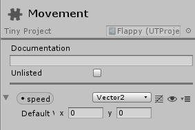
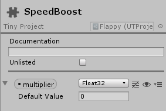

# Entity Filters

You can extend **ut.EntityFilter** to model queries, or filters, against a given World.

Here's an example. Consider these two custom components, defined in the editor:

One called **"Movement"** with a **Vector2** field named **"speed"**:



And one called **"SpeedBoost"** with a **Float32** field named **"multiplier"**:




The following filter selects all Entities with the built-in components **TransformNode** and **TransformLocalPosition**, and our custom component **Movement** and _optionally_ the **SpeedBoost** component:
```
// Scripts/MovementFilter.ts

namespace game {

  export class MovementFilter extends ut.EntityFilter {
    node: ut.Core2D.TransformNode;
    position: ut.Core2D.TransformLocalPosition;
    movement: game.Movement;
    speedBoost?: game.SpeedBoost;
  }
}
```

On **ut.EntityFilter** class extensions, fields of type **ut.Component** are _automatically_ assigned to filter instances during iteration. For example:
```
// Scripts/MovementSystem.ts


namespace game {

  export class MovementSystem extends ut.ComponentSystem {
    filter: MovementFilter = new MovementFilter();
    OnUpdate(): void {
      let dt = this.scheduler.deltaTime();
      this.filter.ForEach(this.world, (entity) => {

        // node and movement are required: they're available
        let data = this.filter;

        var s = data.movement.speed;

        // speedBoost is optional: you need to check for its existence before using it
        if (data.speedBoost) {
          let m = data.speedBoost.multiplier;
          s.x *= m;
          s.y *= m;
        }

        var localPosition = data.position;
        let p = localPosition.position;
        localPosition.position = new Vector3(p.x + s.x * dt, p.y + s.y * dt, 0);
      });
    }
  }
}
```