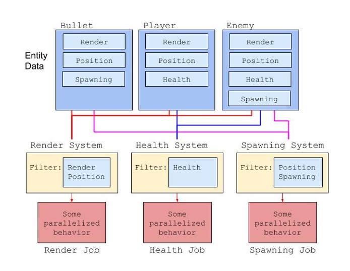

# Systems

In Tiny Mode, a **System** is a function that processes entity data.




In the example above, the _Bullet_ entity is processed by the _Render System_ since it contains both the _Render_ and _Position_ components. It is also processed by the _Spawning System_ since it contains the _Position_ and _Spawning_ components.


## Creating a System

First, make sure you have a Tiny project open. Then, click on the **Tiny > Create > TypeScript System** menu item to create a new script in your project's **Scripts** folder.

The **Scripts** folder is created for you by default. You can rename or move it in the Project window. You can also set it using the **Tiny** section of the **Settings** window and edit the **Script Root Directory** property.
```
// Scripts/NewSystem.ts

namespace game {

    /** New System */
    export class NewSystem extends ut.ComponentSystem {

        OnUpdate(): void {

        }
    }
}
```

Let's break this script down and explain every part.

`namespace game` is your Tiny project **Default Namespace** property. You can change it as needed in the [main settings](settings-main).

`export class NewSystem` means you're exposing the **NewSystem** class in the **game** namespace. You can change the class name as needed, but you must add the **export** modifier when declaring a system, otherwise it won't be considered.

`extends ut.ComponentSystem` means you're extending the built-in **ut.ComponentSystem** class, which is the base class for all user-defined systems in Tiny. **ut** is the default namespace in Tiny, and exposes every class and module of the scripting API.

`OnUpdate(): void` is a function you need to implement when extending the **ut.ComponentSystem** class. It is called exactly once per frame. This method takes no parameters, and returns nothing.


## Processing Entity Data

Once you have created a new empty system as above, you can add code to it so that it processes Entity data in a useful way.

Systems can process data by iterating over entities with a specific component _specification_.

[Components are data objects](components) defined in the Editor. Use the _Tiny > Create > Component_ menu to create a new [custom Component](creating-custom-components).

_Note: you can only define Tiny Mode components in the Editor. **You cannot define a component in TypeScript.**_

When you create a component in the Editor, you automatically and immediately get TypeScript support for it in your IDE. Unity automatically creates a component class named after your component in your project's default namespace, which extends the base **ut.Component** class.

Here's a simple System example.
```
// Scripts/LogPosition.ts

namespace game {

  /** Logs the 2D world position of every entity to the console. */
  @ut.executeAfter(ut.Shared.PlatformRenderingFence)
  export class LogPosition extends ut.ComponentSystem {

    static onlyOnce: boolean = false;

    OnUpdate(): void {
      if (LogPosition.onlyOnce)
        return;
      LogPosition.onlyOnce = true;

      this.world.forEach([ut.Entity, ut.Core2D.TransformNode], (entity, transformNode) => {
        let worldPos = ut.Core2D.TransformService.computeWorldPosition(this.world, entity);

        console.log(`${this.world.getEntityName(entity)} is at (${worldPos.x}, ${worldPos.y})`);
      });
    }
  }
}
```

`this.world.forEach(filter, callback)` is how you iterate over each entity matching the given set of components in that world. Internally, Unity optimizes this loop to make it run as fast as possible.

`[ut.Entity, ut.Core2D.TransformNode]` is a simple component type array filter that means "_give me all entities with at least the `ut.Core2D.TransformNode` component_". Adding `ut.Entity` in a filter allows you to access the entity handle within the loop.

`(entity, transformNode) => { ... }` is the function called once for each entity returned by the filter.

In this example, the **LogPosition** system uses the **TransformService** to get the world position of an entity and log it. You can see the output in the _Console_ section of your browser's _Developer Tools_.


*   [Chrome DevTools](https://developers.google.com/web/tools/chrome-devtools/)
*   [Firefox Toolbox](https://developer.mozilla.org/en-US/docs/Tools/Tools_Toolbox)
*   [Safari Developer](https://support.apple.com/en-ca/guide/safari-developer/welcome/mac)

Let's consider another example.
```
// Defined in the Editor

game.Thing:
    radius: Int32
    time: Float32
    speed: Float32


// Scripts/CircleMovement.ts

namespace game {

  /** Moves things in circle */
  @ut.executeAfter(ut.Shared.UserCodeStart)
  @ut.executeBefore(ut.Shared.UserCodeEnd)
  export class CircleMovement extends ut.ComponentSystem {

    static readonly twoPi: number = 2 * Math.PI;

    OnUpdate(): void {
      let dt = this.scheduler.deltaTime();

      this.world.forEach([ut.Entity, game.Thing], (entity, thing) => {
        let r = thing.radius;
        let t = thing.time + dt;

        let angle = t * CircleMovement.twoPi * thing.speed;

        let x = r * Math.cos(angle);
        let y = r * Math.sin(angle);

        // the iteration doesn't include the `ut.Core2D.TransformLocalPosition` component,
        // you must get and set its component data explicitly, or use the `usingComponentData` helper method

        this.world.usingComponentData(entity, [ut.Core2D.TransformLocalPosition], (position) => {
          position.position = new Vector3(x, y, 0);
        });

        // `thing` is a component view - that is, you can write directly to it
        thing.time = t;
      });
    }
  }
}
```

The **CircleMovement** system operates on every entity with a **game.Thing** component. Within the **OnUpdate** method, it first reads the frame delta time from the _scheduler_ (in seconds), and then sets the local position of every entity returned by the filter as a function of the **time**, **radius**, and **speed** properties.

The system itself also stores a constant, 2 times Pi, to model a full rotation per second (at a speed of 1.0). Systems shouldn't store entity data outside the **OnUpdate** function, but constants like this one are fine.

The animation state is stored in the **time** property, updated every frame.


### **Scheduling Systems**

The **CircleMovement** example above will run each frame, but it could run anytime _during_ a frame. That is, it could be the first system to be executed, or the last...

If you need systems to execute before or after other systems, you need to instrument your code with _decorators_.

**@ut.executeAfter** and **@ut.executeBefore** are two decorators you can use to schedule your systems. They take any number of system types as parameters, and create an edge in the system execution graph.

**ut.Shared.UserCodeStart** is a special system, called a Fence.
