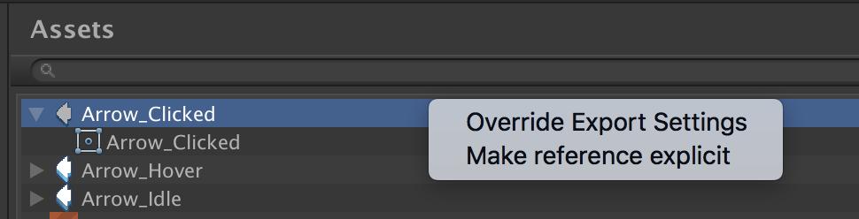
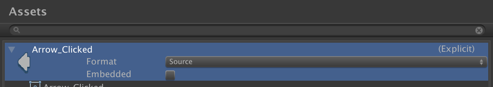

# Tiny Settings - Assets section

The assets settings window lists all assets used in your current Tiny Mode project. 

From this window you can specify whether individual assets should be explicitly loaded via scripts, or implicitly discovered. You can also override the export settings for individual assets.

## Explicit references

Right-click on an asset and select **Make reference explicit** to make that asset an explicit reference. The word **(Explicit)** will appear next to the asset.

You can right click an explicit asset and select **Remove explicit reference** to switch the asset back to an implicit reference.

An Explicit asset reference can be used to load an asset via scripts. Implicit asset references are discovered automatically.

You can drag an asset from the Project window into this panel to add an Explicit reference.

## Override export settings

You can override asset settings individually. To do this, right click on an asset and select **Override export settings**.

Using this setting you can override compression types for individual sprites.

You can also control whether assets are embedded or streamed. This is how, for example, you could stream a long music file, for example, and embed small images, short SFX, and other assets with small file sizes.
