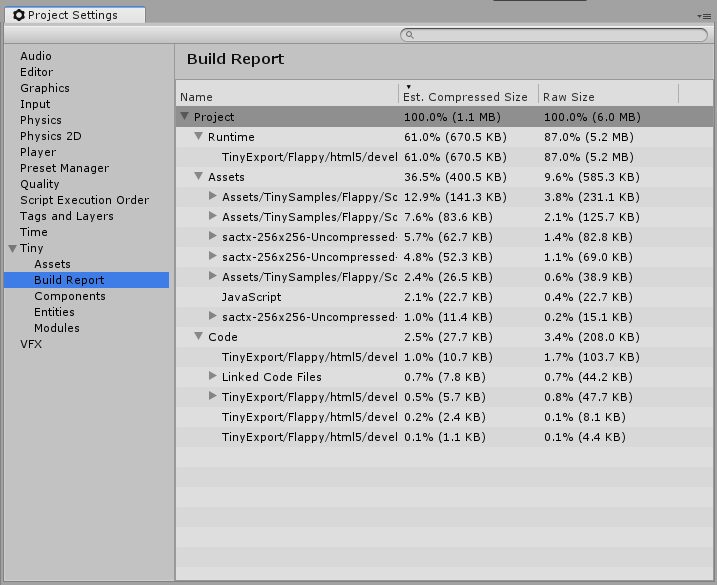

# Tiny Settings - Build report section

After a build, this section is updated. You can use this report to figure out which assets are taking most space in your build, and optimize them - reduce the size of textures, change compression settings, and so on.

The compressed size is an estimated size only, used to give an idea of how much data will be transferred over network when compression is used server-side. The raw size is the actual size before any compression is applied.

The report is split into three sections, Runtime, Assets and Code.