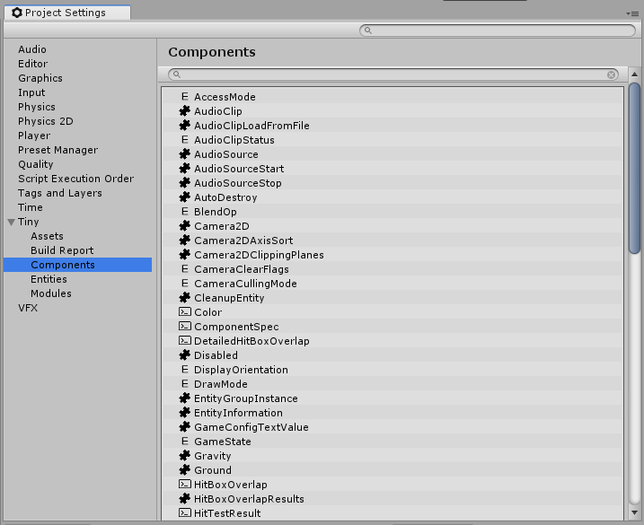

# Tiny Settings - Components section

This window lists all components, structs and enums available in your project, based on which modules you included. Selecting an item will highlight the component asset (.uttype) in the Project window.

Three icon types are used to indicate the types of item:
- The "puzzle piece" icon represents a component.
- The "command prompt" icon represents a struct.
- The "E" icon represents an enum.
