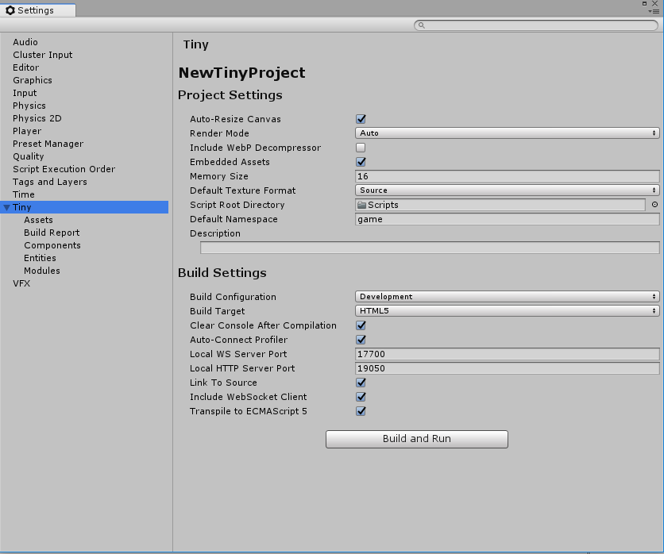

# Tiny Settings - Main Settings

## Project Settings

|Property||Description|
|---|---|---|
|**Auto-Resize Canvas**||Enable this option to set the rendering canvas size to fill the entire web frame (browser or application window).  Disable it to set rendering canvas size to the width and height you specify.|
|**Render Mode**||Specify how the canvas should be rendered|
||Auto|Automatically use best rendering mode available.|
||Canvas|Use HTML5 canvas rendering.|
||WebGL|Use the latest available version of WebGL.|
|**Embedded Assets**||Enable this option to embed asset data into the build using Base64 encoding.  Disable it to package assets as separate files.   **Note:** Enabling this option increases total asset size by approximately 37%.|
|**Default Texture Format**||Choose a default file format for packaging textures.|
||Source|Use the texture file's original storage format.|
||PNG|Force PNG format.|
||JPG|Force JPG format.|
||WebP|Force WebP format.|
|**Default Namespace**||Enter the default namespace name used for components, systems, and so on.|
|**Description**||Enter a brief description of your project.|

## LiveLink Settings

|Property||Description|
|---|---|---|
|**Local WS Server Port**||Enter the number of the port to use when starting local WebSocket server.  **Note:** If the port is unavailable, Tiny tries the next available ports one after the other until it finds a usable port or reaches the last available port (highest available port number).|
|**Local HTTP Server Port**||Enter the number of the port to use when starting local HTTP server.  **Note:** If the port is unavailable, Tiny tries the next available ports one after the other until it finds a usable port or reaches the last available port (highest available port number).|
|**Auto-Connect Profiler**||Enable this option to connect to Unity's profiler when opening a preview.  **Note:** This option is only available in Debug and Development configurations.|

## Build Settings

|Property||Description|
|---|---|---|
|**Build Configuration**||Choose the type of build configuration.|
||Debug|Set build configuration to Debug|
||Development|Set build configuration to Development|
||Release|Set build configuration to Release|
|**Build Target**||Choose the target build platform.  **Note:** Currently, HTML5 is the only available build target.|
||HTML5|Set the target build platform to HTML5.|
|**Include WebP Decompressor**||Enable this option to include WebP decompressor polyfill code in the build. This is required for compatibility with browsers that do not support WebP decoding.|
|**Transpile to ECMAScript 5**||Enable this option to transpile user code to ECMAScript 5. This is required for compatibility with browsers that do not support ECMAScript 6 or above.|
|**Memory Size**||Set the total amount of memory allocated for the project, in MB.  **Note:** This value must be a multiple of 16 MB.|
|**Symbols In Release Build**||Enable this option to include debug symbols (used to get a readable call stack) in Release builds.|
|**Minify JavaScript**||Enable this option to remove from the source code all unnecessary characters that can be removed without affecting functionality.  **Note:** This option is only available in Release configurations.|
|**Single File Output**||Enable this option to merge all output JavaScript files into a single file.  **Note:** This option is only available in Release configurations.|
|**Link To Source**||Enable this option to serve original source files instead of intermediate source files via HTTP server.  Leave it disabled to serve intermediate source files.  **Note:** This option is only available in Debug and Development configurations.|
