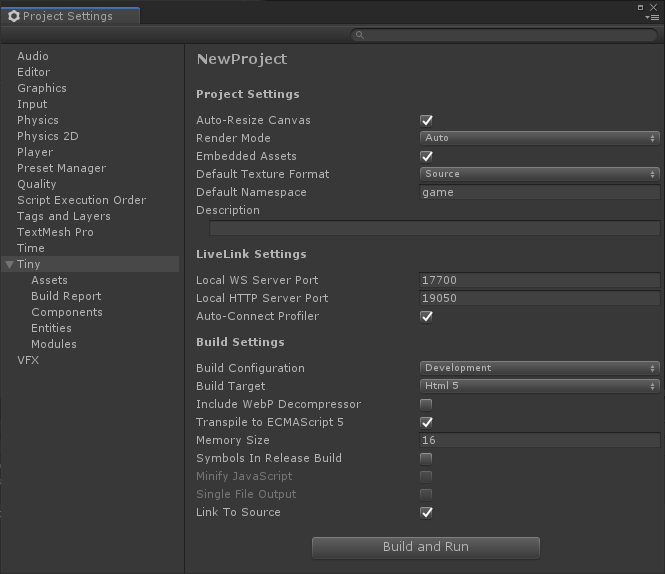

# Tiny Settings - Main Settings section

## Project Settings

|Property||Description|
|:---|:---|:---|
|Auto-Resize Canvas:|||
|Render Mode:
||Auto||
||Canvas||
||Web GL||
|Include WebP Decompressor|||
|Embedded Assets|||
|Memory Size|||
|Default Texture Format|||
||Source||
||PNG||
||JPG||
||Web P||
|Script Root Directory|||
|Default Namespace|||
|Description|||

## Build Settings

|Property||Description|
|:---|:---|:---|
|Build Configuration|||
||Debug||
||Development||
||Release||
|Build Target|||
|HTML 5|||
|Clear Console After Compilation|||
|Auto-Connect Profiler|||
|Local WS Server Port|||
|Local HTTP Server Port|||
|Link To Source|||
|Include WebSocket Client|||
|Transpile to ECMAScript 5|||