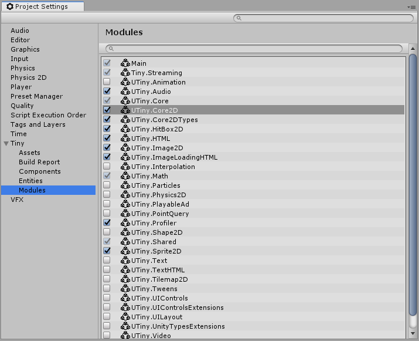

# Tiny Settings - Modules Section

The Modules section displays all [Modules](modules) available in Tiny Mode, along with a checkbox to show whether each module is enabled in your current project. You can use this section to enable or disable individual modules. 

For more information about individual modules and the features they provide in your project, see the [Modules](modules) section of the documentation.