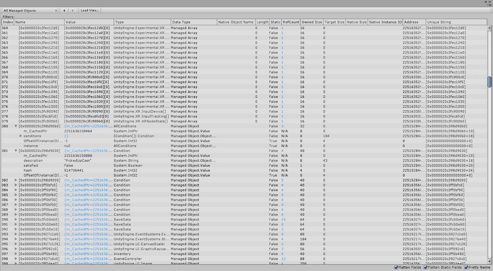

# Table view

This view mode is used to display crawled snapshot data in spreadsheet form. It allows the user to process the data using filters (sort, group, match), to extract relevant information. The default tables include:

* __All Objects__: a collection of all objects (native and managed) in the snapshot.
* __All Managed Objects__: a collection of all managed objects (IL2CPP or Mono) in the memory snapshot.
* __All Native Objects__: a collection of all native objects of types inheriting `Unity.Object` in the memory snapshot.

## All Objects

## All Managed Objects

## All Native Objects

## Table columns 

The following is an overview of what each column means:

> **Note**: "Rest" means, in all other cases.

|   **Column**   | **Description** |
| :---------- | :------------ |
| __Index__ | Index of the entry in the __All Objects__ table.  |
| __Name__ | **For objects**: address in the memory. **For variables**: the name of the variable, that description is in the rest of the columns. |
| __Value__ | **For objects with variables**: you can find here short peek into them. **For objects without variables**: address in the memory. **For variables**: the value of the variable. |
| __Type__ | **For objects**: the class of the object. **For objects variables**: the class of the variables. |
| __Data Type__ | One of the values: Managed Array (Mono/IL2CPP array), Managed Object (Mono/IL2CPP object), or Native Object (C++ object) |
| __Native Object Name__ | **For managed objects**: this field is empty. **For managed arrays**: this field is empty. **For native objects**: the name of the object. |
| __Length__ | **For managed objects**: this field is empty. **For managed arrays**: this field contains the number of elements in the collection. **For native objects**:  this field is empty. |
| __Static__ | Is the field static? |
| __RefCount__ | Count of other objects that reference this object. |
| __Owned Size__ | **For managed objects**: size of the managed type. **For managed references**: the size of the pointer. **For native objects**: the size of the object. **Rest**: 0 |
| __Target Size__ | **For static values**: size of type. **For managed references**: size of referenced objects. **For native references**: the size of the referenced native object. **Rest**: 0 |
| __Native Size__ | **For native objects**: the size of the object. **Rest**: this field is empty. |
| __Native Instance ID__ | **For managed objects**: ID for the corresponding native object. **For managed arrays**: this field is empty. **For native objects**:  this field is empty. |
| __Address__ | Address in the memory. |
| __Unique String__ | [Internal] entry used for comparison of objects. |

## Diff tables

When you inspect the __Diff__ of two snapshots, all the tables described above are still available as diff tables. The Diff tables, such as __Diff All Objects__, __Diff All Managed Objects__, __Diff All Native Objects__, are mostly the same as the corresponding tables without “Diff” in their name. The key difference is that they contain a __Diff__ column (see #1 in the Screenshot). For each object in the table, the Diff column states, whether this object is either the __Same__, __New__, or __Deleted__. 

Based on their capture/import date, you can see that one snapshot is labeled new and one is labeled old under the date shown in the Open Snapshots view (see #2 in the screenshot).

## Filtering tables

The header of each table column can be clicked to open a filtering drop-down menu:

With this menu, you can:

### Group 

Groups together all objects with a matching value in this column, and you can apply it to multiple columns. The order in which you add the filters affects the grouping as demonstrated below.

### Sort Ascending/Descending

This filter sorts the table based on the values of this column. There can only be one column, that defines the order of the table. 

### Match…

Adds a text field where you can enter a value to search for a match or a string contained in any cell of this column. You can only see rows that match this filter.
After adding the Filters, they will appear above the table (see #1 in the screenshot). The __X__ Buttons can be clicked to remove the filters again. The Group filters apply from left to right (or oldest to newest). In this example, the elements first get grouped by their __Diff__ value, so that there are three big groups: __New__, __Deleted__, and __Same__. Next, the elements in each of these groups get grouped again by their __Type__. 
If the groups were applied the opposite way around, there would be many rows grouped by Type, and each would contain up to three sub-groups: __New__, __Deleted__, and __Same__.

In the screenshot below, the base group __New__ is expanded and many rows appear to be mostly empty. That is because these contain groups of types that have more than one object of this type in them. Aggregated __Values__, such as their size, are summed up, other columns stay empty. You can expand elements contained in columns that have a group filter applied, such as the type [AudioClip](https://docs.unity3d.com/ScriptReference/AudioClip.html) in this example (see #3).
Each group contains the count of objects in their group in brackets (12 in case of the `AudioClip` objects).

The name of columns with a group filter is inside square brackets [ ]. In addition to the two group filters, it sorts this table by the __Owned Size__ column (see #2). 
The names of columns with a sorting filter show an arrow indicating whether the sorting is ascending or descending.

[Back to manual](manual.md)