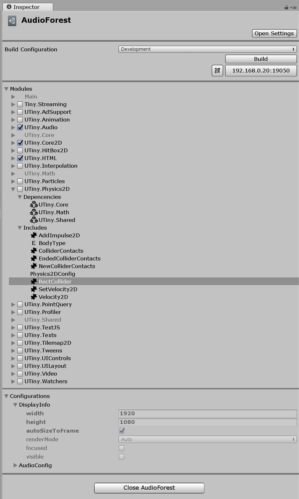

# Tiny Mode Projects

A Tiny Mode project represents a game or app which can be deployed to platforms that Tiny Mode supports. 

A Tiny Mode project is represented by an Asset within a regular Unity Project. This means a single Unity Project can contain multiple Tiny Mode projects. Tiny Mode projects are represented by an asset file in the Project window. Tiny mode projects have the `.utproject` filename suffix. The Tiny Mode project file contains information about which [Tiny Mode modules](modules.md) are used within the Tiny Mode project, and various [settings](settings-main.md) relating to Tiny Mode such as the display size.

You can get started by creating a new Tiny Mode project from the **Tiny > File > New Project** menu. Choose a name for your new Tiny Mode project file, and save it within your Unity Project. Unity will then automatically open the new Tiny Mode project, and switch to Tiny Mode.

When in Tiny Mode, you can only use Entities and EntityGroups in your Hierarchy, and your Entities can only accept Tiny Mode components.

## The Tiny Mode Project Inspector

When you have a Tiny Mode project open, you can select the Tiny Mode project asset in your project window to see settings related to that project in the inspector. The settings include the Build Configuration, [Modules](modules.md), and Display and Audio settings.

_Note: If you select a Tiny Mode project asset that is not currently open, the inspector is empty except for an **open** button which allows you to open that project._

## Build Configuration

The **Build Configuration** section allows you to [build and test your project](building-and-testing.md).

## Modules

The modules section show which modules are currently used in your Tiny Mode project. You can enable and disable modules here. This section is the same as the [modules section in the settings window](settings-modules.md).

## Configurations

### DisplayInfo

### AudioConfig

The AudioConfig section allows you to pause or unpause the audio in your project.

<!-- TO DO : displayinfo and audioconfig descriptions -->