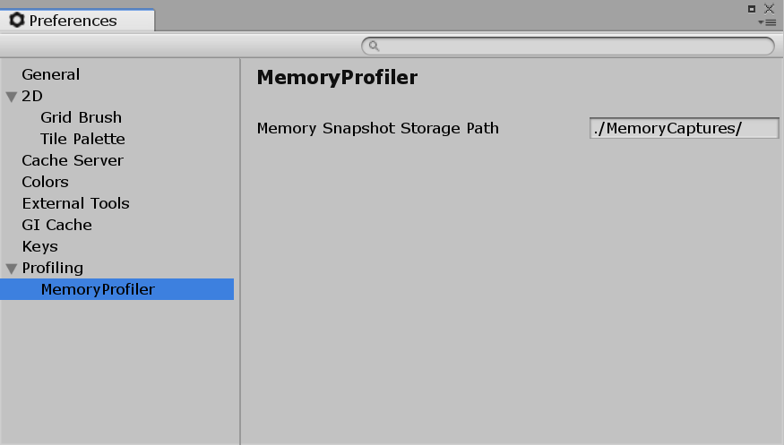

# Memory Profiler tips and troubleshooting

When using the Memory Profiler package, you shoud be aware of the following:

## Find snapshots on your machine

When you create a snapshot for the first time, the Unity __Editor__ will create a sub-folder under your _Project_ folder called _MemoryCaptures_. This folder is where all of your snapshots are stored.

## Change default snapshot path

By default, the location of all snapshots that you capture or import is _<Path/of/Your/ProjectFolder>/MemoryCaptures_. You can change that default path in the Unity __Preferences__ Window under __Profiling__ > __Memory Profiler__. 

> **Note**: The path has to be relative, i.e., it must start with “./” or “../” to denote its location within, or one folder hierarchy above, the Project folder respectively.

## Rename snapshots

To rename a snapshot, open the _MemoryCaptures_ folder in Finder or Explorer and look for the snapshot file you want to rename. Then rename the snapshot like any other file, and the Editor will refresh the metadata automatically.

## Ignore snapshot files

Add the .snap extension to your version control system’s [ignore file](https://www.atlassian.com/git/tutorials/saving-changes/gitignore) to avoid committing memory snapshot files to your repository. Memory snapshot files can take up large amounts of disk space.

## Regular inspections

Inspect your memory usage regularly, even at the earliest stages of production, to minimize the risk of not being able to fit your product on the target device.

## Define snapshot metadata

When capturing a snapshot, it is possible to generate [MetaData](https://docs.unity3d.com/2018.3/Documentation/ScriptReference/Profiling.Memory.Experimental.MetaData.html) on the __Player__ side. If the __Player__ builds from a project that has the Memory Profiler package added to it, it generates some default metadata.
The default metadata consists of:
* [MetaData.content](https://docs.unity3d.com/2018.3/Documentation/ScriptReference/Profiling.Memory.Experimental.MetaData-content.html) - Containing the project's name (and the Scripting version when capturing the __Editor__).
* [MetaData.platform](https://docs.unity3d.com/2018.3/Documentation/ScriptReference/Profiling.Memory.Experimental.MetaData-platform.html) - The [RuntimePlatform](https://docs.unity3d.com/ScriptReference/RuntimePlatform.html) of the __Player__ or the __Editor__ that was captured, stored as a string. 
* [MetaData.screenshot](https://docs.unity3d.com/2018.3/Documentation/ScriptReference/Profiling.Memory.Experimental.MetaData-screenshot.html) - A screenshot taken at the moment of the capture. Its size is under 480x240.

When capturing snapshots, you should always try to define some metadata on the __Player__ side to have a good overview of the content of your snapshot. There are two ways to do so:
* When you don't have the Memory Profiler package in the project from which you create your builds but still want to add metadata to your snapshots, register a listener to [MemoryProfiler.createMetaData](https://docs.unity3d.com/2018.3/Documentation/ScriptReference/Profiling.Memory.Experimental.MemoryProfiler-createMetaData.html).
* If you do have the package in your project, you can stick with the default data or write a metadata collector, see [Add Player hook](#add-player-hook) below.

## Add Player hook

If you want to define custom metadata in a Project that has the Memory Profiler package added to it, create a class inheriting from `Unity.MemoryProfiler.IMetadataCollect`. 

You will need to implement `void CollectMetadata(MetaData data)` in which you fill `data` with the information you want.

You can create multiple classes inheriting from `Unity.MemoryProfiler.IMetadataCollect` but their `CollectMetadata` methods have no defined call order.

If you have a class that inherits from `Unity.MemoryProfiler.IMetadataCollect`, it does not generate the default metadata described in __Define snapshot metadata__. If you want to keep some or all of the default metadata, go to the file _com.unity.memoryprofiler/Runtime/MetadataInjector.cs_ and copy the content you want to keep from `DefaultCollect(MetaData data)` into your implementation.

[Back to manual](manual.md)