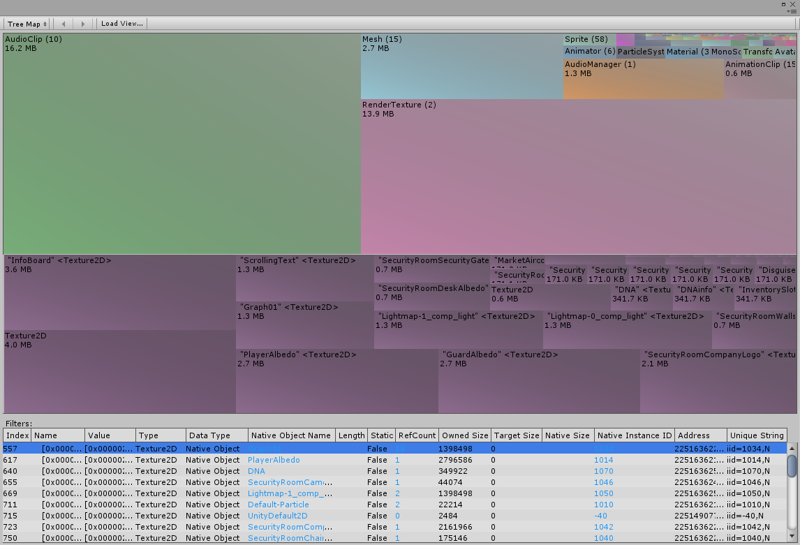

### Tree Map

The Tree Map takes the memory data of a snapshot and visually groups them under different object categories. The size of each category represents how large its memory footprint is, compared with other categories.

If you click an object category in the Tree Map, a white rectangle will appear around it, indicating that it’s selected. At the same time, all the objects within that category show up within the selected item. 

#### Tree Map Table View

Below the Tree Map, is a [Table view](table.md) that lists all the objects in a selected object category. If no object category is selected, it contains all objects in the given memory snapshot. If you click one of the objects in a category box, the Table view highlights the row relating to that object.

[Back to manual](manual.md)