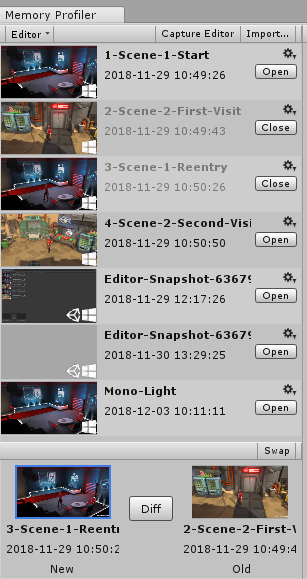

# Workbench

The Workbench is the panel on the left side of the Memory Profiler window. It contains all the memory snapshots that are [part of your project](tips-and-troubleshooting.md#change-default-snapshot-path). Each snapshot in the Workbench has:

* A screenshot from the moment of the capture.
* Icons on the screenshot denoting the platform the snapshot was taken on.
* A Unity logo denotes a capture taken within the __Editor__.
* The name in bold letters.
  * Click the name to rename it.
  * Hover over the name to see the full path.
* Date and time of the capture.
  * The time is stored as UTC but converted to the local machine’s time for displaying.
  * Hover over the date and time to see the snapshot's metadata, by default that is: 
    * The Project name.
    * The Scripting Runtime Version (for snapshots taken within the Editor).
* An options menu accessed through the cogwheel icon lets you:
  * Rename the snapshot.
  * Delete the snapshot.
* An __Open__/__Close__ button.

Clicking the __Open__ button will load the corresponding snapshot into memory and process it for display. Therefore, opening it can take a few moments, depending on the size of the capture. Once opened, the Main view will display different visualizations of the snapshot data.

Open snapshots have greyed out text and the __Open__ button changes to a __Close__ button. Renaming or deleting a snapshot requires the snapshot to be closed, as those operations directly affect the saved file.

## Open Snapshots view

Below the list of snapshots, is the Open Snapshots view that displays the currently opened snapshots. Opening a snapshot can take a moment to load. To compare snapshots, you need a quick way to switch between them. To achieve this, up to two snapshots can be kept open (in memory) and will be displayed in this area. By clicking on either of the screenshots, the [Main view](main-view.md) will switch to the last open view of that snapshot. The snapshot that is currently displayed gets a blue outline.

## Diff snapshots

If two snapshots are open, the __Diff__ button between them becomes available. Click the button to display the difference between the two snapshots. The first time it is pressed for a particular set of snapshots, it will take a bit longer to process and generate the data for the diff view. Once generated, switching to the diff view is instant. Closing one of the two snapshots (or opening a new one, which will close the second snapshot) will unload the diff data.

## Swap snapshots

The __Swap__ button in the toolbar of this area will swap the left and right snapshots with each other. This option is useful if you want to avoid the right snapshot from being closed and discard the left one when opening your third snapshot. As an example:

* Open snapshot A (A is left).
* Open snapshot B (A shifts to the right, B is left).
* Diff B and A.
* Swap B and A (so A is now left, and B is right).
* Open snapshot C (snapshot B closes, C is left, A is right).
* Diff C and A.

[Back to manual](manual.md)

