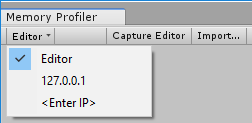

# Workflow: How to capture a memory snapshot

* [Open the Memory Profiler](memory-profiler-window.md).
* Decide which target to profile, e.g., the __Editor__ itself or a running __Player__ (either on your local machine or on a connected device).
* In the Memory Profiler window, click the __Attach__ drop-down menu and select the target to profile.
* Click the __Capture__ button at the top of the Memory Profiler. The snapshot will appear on the left side of the Memory Profiler window in the [Workbench](workbench.md) panel.

> **Note**: The __Capture__ button will be labeled __Capture Editor__ when the Memory Profiler is targeting the Editor, and the Editor is not in __Play Mode__. In that case, it will capture the Editor. If the target is a built Player or the Editor in Play Mode, it will be labeled __Capture Player__. Capturing a snapshot of the Editor while in Play Mode will include any memory used by the Editor as well. Memory usage in a Play Mode player is not representative of the memory usage on a device. It is always recommended to capture snapshots from a built Player on the targeted platform.

You can also trigger a memory snapshot at any moment you decide, without any interaction with the Memory Profiler window. Use the [Memory Profiler Scripting API](https://docs.unity3d.com/ScriptReference/Profiling.Memory.Experimental.MemoryProfiler.TakeSnapshot.html) to set up capture logic in a script inside your Player. For information about custom [MetaData](https://docs.unity3d.com/ScriptReference/Profiling.Memory.Experimental.MetaData.html) collection, see [Add Player hook](tips-and-troubleshooting.md#add-player-hook).

[Back to manual](manual.md)