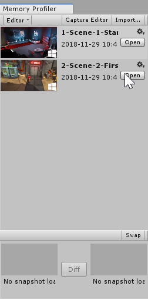
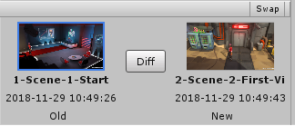

# Workflow: How to find memory leaks

## Introduction

More often than not, developers encounter [memory leaks](https://en.wikipedia.org/wiki/Memory_leak) within their applications. Memory leaks can slow down your application and ultimately lead to crashes.

Memory leaks typically occur due to one of two issues:
* An object that is not released manually from memory through the code.
* An object stays in memory because of an unintentional reference.

The Memory Profiler can be used to track down these leaks in both managed and native memory.

The goal of this workflow will be to capture multiple memory snapshots over a specific timeframe and compare them inside the Memory Profiler window using the __Diff__ mode.

For more information, see [Workbench Diff snapshots](workbench.md#diff-snapshots).

## Inspect memory usage and find memory leaks

### Allocated objects after Scene unload

There are multiple patterns in which memory leaks occur. A common one is when resources, or user allocated objects, are not cleaned up after unloading a __Scene__. The following steps depict a basic workflow for attempting to identify such issues.

1. Make sure the Memory Profiler is attached to your running Player.

2. In the Player, load an empty [Scene](https://docs.unity3d.com/Manual/CreatingScenes.html).

3. [Create a memory snapshot](memory-profiler-window.md#how-to-capture-a-memory-snapshot) of the empty Scene.

4. Load the Scene that you wish to test for leaks.

5. Play through the Scene. E.g., if the Scene contains a level of a game, play through a bit of that level.

6. Unload the Scene or switch to an empty Scene. 
   > **Note**: To fully unload Assets in the last opened scene; you will need to either call [Resources.UnloadUnusedAssets](https://docs.unity3d.com/ScriptReference/Resources.UnloadUnusedAssets.html) or load into two new scenes (e.g., Load Empty Scene twice).

7. Take another snapshot.

8. You can now close the Player (optional). It is a recommended step when you are working with large snapshot files, to avoid the snapshot and Player competing for memory on low-end machines.

9. In the [Memory Profiler window](memory-profiler-window.md), open the first snapshot. You’ll find it in the [Workbench](workbench.md), second from the bottom of the list. Opening a snapshot might take a few moments, depending on the size of the snapshot file.

10. Then, open the second snapshot from the bottom of the list in the Workbench.

11. At the bottom of the Workbench, the two open snapshots are side by side. Click the __Diff__ button in-between them, this might take a few moments, depending on the size of the snapshot file. You will then see the __Diff__ table for all objects.

12. Click the table header for the __Diff__ column; this presents you with a drop-down menu:

    

13. Select the __Group__ option. You’ll see the data entries grouped by __Deleted__, __New__, and __Same__.

14. Under __New__, you’ll find a list of all objects that are only present in the second snapshot. These are potential memory leaks.

### Small continuous allocations during application lifetime

Another typical pattern occurs when we have small continuous allocations that arise after a particular event in the lifetime of the Unity application. The following steps show a workflow in identifying such leaks.

1. Make sure the [Profiler](https://docs.unity3d.com/Manual/Profiler.html) is attached to your running Player.

2. Load the scene you’d like to check for leaks.

3. Create a snapshot.

4. Play through the Scene, observe the memory footprint growing steadily in the [Profiler window](https://docs.unity3d.com/Manual/ProfilerWindow.html) (under the Memory tab).

5. Create another snapshot.

6. Continue playing the Scene.

7. Create another snapshot.

8. You can now close the Player (optional). It is a recommended step when you are working with large snapshot files, to avoid the snapshot and Player competing for memory on low-end machines.

9. In the Memory Profiler window, open the second snapshot you’ve taken. Opening a snapshot might take a few moments, depending on the size of the snapshot file.

10. Open the third snapshot you've taken. Then click the __Diff__ button in the [Open Snapshots view](workbench.md#open-snapshots-view), this might also take a few moments, depending on the size of the snapshot file. You will then see the __Diff__ table.

11. Click the table header of the __Diff__ column; this presents you with a drop-down menu:
  
    
    
12. Click on the __Owned Size__ table header and select __Group__; this filters objects based on their presence in the snapshots and their size.

13. Click again on the __Owned Size__ table header and select __Sort Descending__ this sorts all the groups based on their size.

14. Under __Same__ and __New__, attempt to identify the larger groups of allocations present and check if they are present in both __Same__ and __New__ categories. Make a note of any you find. 

15. Repeat steps 11-14 for the first and second snapshots. By repeating the process, we will gain an idea of what the potential leaks or problems are within your system.

[Back to manual](manual.md)