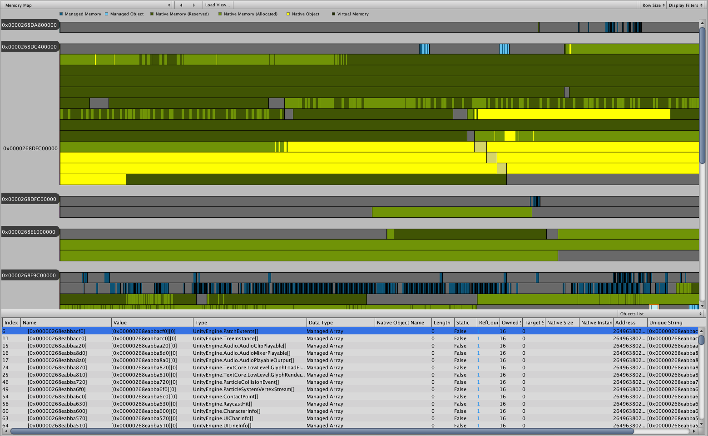
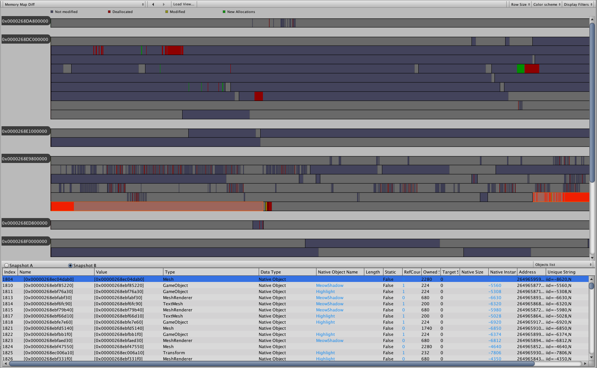

# Workflow: Understanding memory

## Introduction

Developers often discuss CPU performance when talking about issues that slow down games. What is often not considered is how the wrong memory usage can affect performance and lead to severe problems. 

One example of such an issue is [memory fragmentation](https://en.wikipedia.org/wiki/Fragmentation_(computing)). It slows down code execution and can lead to situations where it is impossible to allocate memory even if a global summary (the total amount of free memory in the system) shows that it should be possible.

Memory Map allows you to have a peek into the [memory layout](https://www.cs.utah.edu/~germain/PPS/Topics/memory_layout.html) of your game, to understand how it works, and how it changes between snapshots. This knowledge can then be utilized to write better code that will take advantage of underlying memory systems inside of Unity.

For more information on memory fragmentation, see [Understanding the managed heap](https://docs.unity3d.com/Manual/BestPracticeUnderstandingPerformanceInUnity4-1.html).

## Inspect memory

1. Make sure the Memory Profiler is attached to your running Player.
2. Create a memory snapshot of your __Scene__.
3. You can now close the Player (optional). It is a recommended step when you are taking the snapshot on the same device as the Player. As snapshot files can get quite large, this step is advisable to avoid the snapshot and Player competing for memory on low-end machines.
4. Open the newly created snapshot in the Memory Profiler.
5. Switch to the [Memory Map view](memory-map.md). This option displays a view of all allocations in your Project mapped out along the virtual address space. 

## View memory changes over the time

1. Make sure the Memory Profiler is attached to your running Player.
2. Create a memory snapshot of a situation that interests you.
3. Continue to __Play__ through the Scene.
4. Create a second memory snapshot of a situation that interests you.
5. You can now close the Player (optional). It is a recommended step when you are working with large snapshot files, to avoid the snapshot and Player competing for memory on low-end machines.
6. Open the first snapshot in the [Memory Profiler window](memory-profiler-window.md).
7. Open the second snapshot, then click the __Diff__ button in the [Open Snapshots view](workbench.md#open-snapshots-view). Opening a snapshot might take a few moments, depending on the size of the snapshot file. You will then see the __Diff__ table.
8. Switch to the [Memory Map Diff view](memory-map.md#memory-map-diff-view). This option displays the Memory Map in a mode that highlights the differences between the two snapshots.

[Back to manual](manual.md)